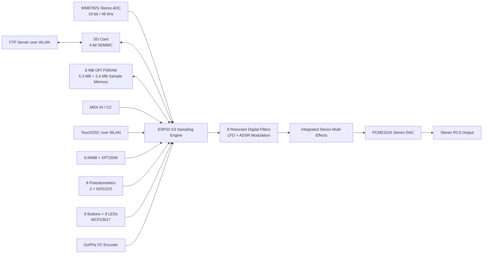

# RTAL-EAI-005-STEREO-SOUND-SAMPLER
## Eight-Voice Dual-Sample Stereo Sampler for ESP32-S3

<p align="center">
  
</p>

<p align="center">
  <strong>Eight voices. Two stereo samples. Resonant filters. Touch control. Wireless file access. Integrated multi-effects.</strong>
</p>

---

## Project Overview

**RTAL StereoSampler 8** is a polyphonic eight-voice stereo sound sampler built around an ESP32-S3 with 8 MB PSRAM.

The instrument was designed as an engineering study to explore how far a modern, highly accessible stereo sampler can be developed with a manageable amount of hardware. Its focus is not only on sample playback, but also on direct operation, flexible sound shaping, wireless integration and a broad internal effects architecture.

Two dedicated stereo samples can be played simultaneously, layered across the complete keyboard range or assigned to separate keyboard zones. Each of the eight voices has its own digitally controlled resonant filter, modulated by an LFO and an ADSR envelope.

WAV loop information is detected automatically when present. Loop points remain part of the sample data when edited material is saved back to the SD card under a freely selectable filename.

The SD card operates in four-bit SDMMC mode and can also be accessed over WLAN through an integrated FTP server. This allows sample files to be exchanged directly from the Windows File Explorer without removing the card from the instrument.

All relevant parameters can be controlled from the touchscreen, MIDI CC, TouchOSC, eight potentiometers, eight buttons and a rotary encoder with push button.

---

## Design Intention

The aim of this project was to create a stereo sound sampler that combines:

- high audio quality,
- eight-voice polyphony,
- two independent stereo sample memories,
- immediate hands-on operation,
- flexible MIDI and network control,
- expressive per-voice sound shaping,
- a comprehensive internal effects section,
- and convenient file exchange over WLAN.

The result is a self-contained embedded sampling instrument with the operating comfort of a much larger system, while still using a comparatively compact hardware platform.

---

## Key Features

### Sampling and Playback

- Eight-voice polyphonic stereo playback
- Two dedicated stereo sample slots
- Parallel layering of both samples
- Independent keyboard-zone assignment
- stereo I²S audio input at 16 bit and 48 kHz
- WAV file loading and saving
- Automatic recognition of embedded WAV loop points
- Loop information preserved when samples are saved
- Freely selectable filenames for exported WAV files
- Dedicated PSRAM allocation:
  - Sample 1: approximately **5.3 MB**
  - Sample 2: approximately **2.4 MB**

### Voice Architecture

Each of the eight voices provides:

- stereo sample playback,
- independent digital filtering,
- adjustable resonance,
- ADSR-controlled filter modulation,
- LFO-controlled filter modulation,
- keyboard and zone allocation,
- and routing into the integrated effects section.

### Control Interfaces

Parameters can be edited using:

- ILI9488 colour touchscreen
- XPT2046 resistive touch controller
- eight physical potentiometers
- eight illuminated buttons
- DuPPa I²C rotary encoder with push button
- MIDI Control Change messages
- TouchOSC over WLAN
- integrated graphical user interface

### Storage and Networking

- SD card connected in four-bit SDMMC mode
- fast sample loading and saving
- integrated FTP server
- file access over WLAN
- direct exchange with Windows File Explorer
- remote parameter control from an iPad using TouchOSC

### Integrated Effects

The internal effects architecture includes:

- Delay
- Reverb
- Flanger
- Phaser
- Chorus
- Wide Stereo
- Pebble

The effects are integrated into the sampler firmware and can be adjusted from the local controls or through the external control interfaces.

---

## System Architecture



---

## Audio Signal Flow

```text
Stereo Audio Input
        │
        ▼
WM8782S I²S ADC
16-bit / 48 kHz
        │
        ▼
Recording / WAV Import
        │
        ├── Stereo Sample Memory 1 — approx. 5.3 MB
        │
        └── Stereo Sample Memory 2 — approx. 2.4 MB
        │
        ▼
Eight-Voice Polyphonic Playback Engine
        │
        ▼
Eight Resonant Digital Filters
LFO and ADSR Modulation
        │
        ▼
Stereo Effects Section
        │
        ▼
PCM5102A I²S DAC
        │
        ▼
Stereo Audio Output
```

---

## Dual-Sample Concept

The instrument contains two independent stereo sample memories.

Both samples can be used in several ways:

1. **Layered playback**  
   Both stereo samples respond across the same keyboard range and are played in parallel.

2. **Split keyboard**  
   Each sample is assigned to its own keyboard zone.

This architecture allows the instrument to operate as a layered sampler, split-keyboard performance instrument or compact dual-sample sound-design platform.

---

## WAV Loop Handling

The sampler analyses WAV files for embedded loop information.

When valid loop markers are present:

- the loop start and loop end positions are detected,
- the corresponding playback loop is configured automatically,
- and the loop metadata is written back into the WAV file when the sample is saved.

This makes it possible to exchange looped material with compatible sample editors while preserving the intended playback behaviour.

---

## Wireless Workflow

The network functions were developed to remove two common interruptions from the sampling workflow: repeatedly removing the SD card and editing every parameter exclusively on the device.

### FTP File Transfer

The integrated FTP server provides access to the SD card over WLAN. Sample files can therefore be copied, renamed, organised and backed up using the Windows File Explorer.

### TouchOSC Control

An iPad running TouchOSC can be used as an additional remote control surface. Parameters can be changed over WLAN without replacing the physical controls or touchscreen.

The local and remote interfaces operate as complementary control layers:

- touchscreen for visual editing,
- potentiometers and buttons for immediate hands-on access,
- rotary encoder for precise value entry,
- MIDI CC for automation and external control,
- TouchOSC for wireless operation.

---

## Hardware

| Component | Function |
|---|---|
| ESP32-S3 with 8 MB PSRAM | Main processor, audio engine, user interface, WLAN and storage control |
| SD card in 4-bit SDMMC mode | Sample storage and project data |
| 2 × ADS1115 | ADC conversion for eight potentiometers |
| MCP23017 | Interface for eight buttons and eight LEDs |
| ILI9488 display | Colour graphical user interface |
| XPT2046 | Resistive touchscreen controller |
| 8 × CRGB LEDs | RGB status indication controlled with FastLED |
| DuPPa I²C encoder with push button | Navigation and precise parameter editing |
| WM8782S module | Stereo I²S ADC, slave mode, 16-bit, 48 kHz |
| PCM5102A module | Stereo I²S DAC |
| PC900 | MIDI input optocoupler |
| Stereo audio potentiometers | Analogue input and output level control |
| RCA input and output connectors | Stereo audio connections |
| 5-pin DIN connectors | MIDI input and output |
| Perfboard construction | Hand-wired prototype using Fädeltechnik |
| Passive components | Resistors, capacitors and supporting circuitry |

---

## User Interface Hardware

The operating panel combines visual, tactile and remote interaction.

### Local Controls

- ILI9488 touchscreen display
- eight potentiometers
- eight illuminated buttons
- eight addressable CRGB LEDs
- rotary encoder with push button

### External Control

- MIDI input
- MIDI output
- MIDI CC parameter control
- TouchOSC over WLAN
- FTP access over WLAN

This combination provides immediate access during performance while retaining detailed parameter editing and external automation.

---

## Software Environment

The firmware was developed with:

| Setting | Configuration |
|---|---|
| Arduino IDE | **1.8.19** |
| ESP32 Arduino Core | **2.0.16** |
| Partition Scheme | **Huge APP** |
| PSRAM Mode | **OPI PSRAM** |
| Audio Sample Rate | **48 kHz** |
| Audio Resolution | **16 bit** |
| SD Interface | **4-bit SDMMC** |

---

## Memory Organisation

The 8 MB PSRAM is divided so that both stereo samples have predictable memory resources.

| Memory Area | Reserved Capacity |
|---|---:|
| Stereo Sample 1 | approximately 5.3 MB |
| Stereo Sample 2 | approximately 2.4 MB |
| Remaining memory | system buffers, audio processing and supporting data |

The unequal allocation provides a larger primary sample memory together with a second dedicated stereo sample memory.

---

## Prototype Construction

The instrument was built on perfboard using hand-wired Fädeltechnik rather than a dedicated production PCB.

This approach made it possible to:

- adapt the circuit during development,
- integrate different interface modules,
- optimise the physical control layout,
- test the complete signal path,
- and retain the character of a true engineering prototype.

<p align="center">
  
</p>

<p align="center">
  <em>Front view of the completed sampler prototype.</em>
</p>

<p align="center">
  
</p>

<p align="center">
  <em>Internal construction with ESP32-S3, interface modules and hand-wired perfboard.</em>
</p>

---

## Suggested Image Gallery

| Image | Suggested Filename |
|---|---|
| Complete instrument | `images/rtal-stereosampler-8-hero.jpg` |
| Front panel and touchscreen | `images/prototype-front.jpg` |
| Internal construction | `images/prototype-inside.jpg` |
| Main perfboard wiring | `images/perfboard-wiring.jpg` |
| Display user interface | `images/touchscreen-ui.jpg` |
| Rear audio and MIDI connections | `images/rear-panel.jpg` |
| TouchOSC control page | `images/touchosc-control.jpg` |
| Windows FTP access | `images/ftp-file-access.jpg` |
| WAV playback and loop display | `images/wav-loop-display.jpg` |

---

## Repository Structure

```text
RTAL-StereoSampler-8/
├── README.md
├── LICENSE
├── CHANGELOG.md
├── firmware/
│   └── RTAL_StereoSampler_8/
├── hardware/
│   ├── schematics/
│   ├── wiring/
│   ├── pinout/
│   └── bill-of-materials/
├── docs/
│   ├── user-manual/
│   ├── midi-implementation/
│   ├── touchosc/
│   ├── ftp-workflow/
│   └── wav-loop-format/
├── images/
├── samples/
│   └── demo-content/
└── engineering_archive/
    ├── development-notes/
    ├── test-results/
    └── historical-versions/
```

---

## Planned Repository Documentation

The engineering archive can be expanded with:

- complete firmware sources,
- hardware pin assignment,
- wiring diagrams,
- power-supply information,
- MIDI CC implementation chart,
- TouchOSC template,
- FTP setup instructions,
- sample and WAV format notes,
- operating manual,
- photographs of the development stages,
- audio demonstrations,
- and selected engineering notes.

---

## Open Engineering Approach

This repository is intended as more than a firmware download. It documents the complete development approach behind the instrument:

- embedded real-time audio,
- stereo sample memory management,
- SDMMC file handling,
- WAV metadata processing,
- MIDI and network integration,
- touchscreen user-interface development,
- digital filter design,
- effects processing,
- mixed-signal prototype construction,
- and practical hardware ergonomics.

The project is published as part of the RealTimeAudioLab collection to preserve the engineering work and make it useful for learning, experimentation and future audio-instrument development.

---

## Development Philosophy

> Build capable digital audio instruments from accessible hardware, document the engineering decisions and preserve the complete path from idea to working prototype.

RTAL StereoSampler 8 demonstrates that a compact ESP32-S3 system can combine polyphonic stereo sampling, resonant filtering, touch operation, physical controls, network services and an extensive effects section in one integrated instrument.

---

## License

Unless otherwise noted, the original source code and project documentation in this repository are released under the **GNU General Public License v3.0**.

Third-party libraries, example code and external components remain subject to their respective licenses.

---

## RealTimeAudioLab

**Engineering Digital Audio Since 1990**

RealTimeAudioLab documents embedded audio systems, digital musical instruments, custom audio hardware and engineering heritage projects.

**Preserving Engineering. Inspiring Future Designs.**

---

<p align="center">
  <strong>RealTimeAudioLab</strong><br>
  Embedded Audio Engineering · Digital Musical Instruments · Open Hardware · Engineering Heritage
</p>


